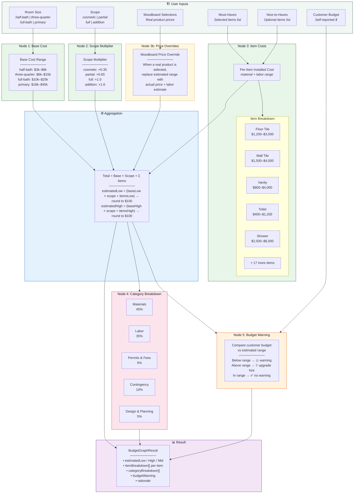
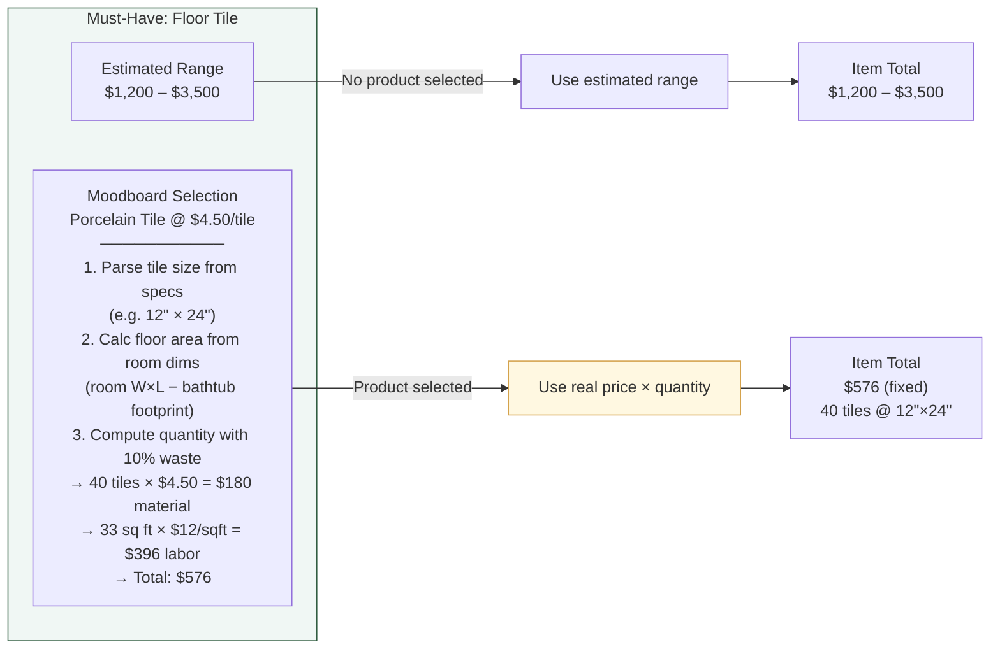
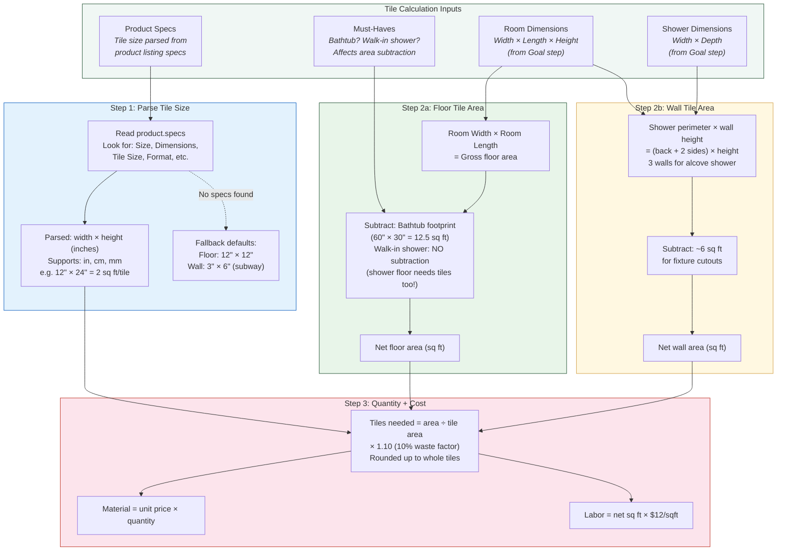
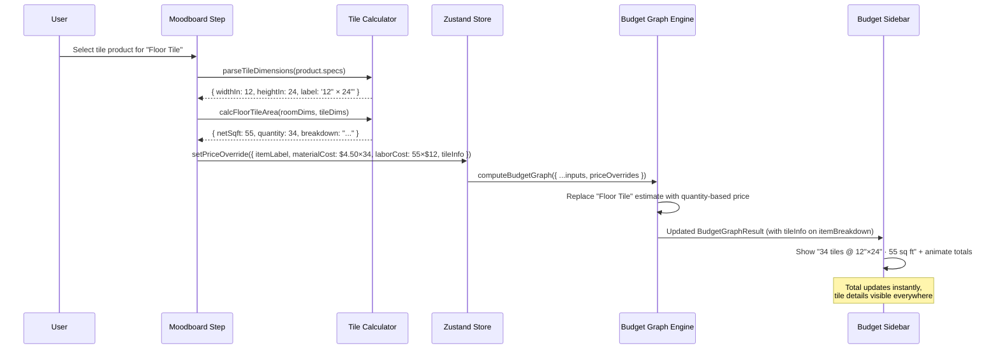

# Budget Estimator — Knowledge Graph

> Visual representation of how the deterministic budget engine computes renovation cost estimates.

## Computation Flow

## Item-Level Breakdown Flow

## Tile Estimation — Smart Quantity Calculation

### Tile Size Reference

| Tile Format | Dimensions | Area per Tile | Tiles per sq ft |
|-------------|-----------|---------------|-----------------|
| Mosaic | 1" × 1" | 0.007 sq ft | ~144 |
| Small mosaic | 2" × 2" | 0.028 sq ft | ~36 |
| Subway (classic) | 3" × 6" | 0.125 sq ft | 8 |
| Small square | 4" × 4" | 0.111 sq ft | 9 |
| Medium square | 6" × 6" | 0.25 sq ft | 4 |
| Standard square | 12" × 12" | 1.0 sq ft | 1 |
| Standard rectangle | 12" × 24" | 2.0 sq ft | 0.5 |
| Large format | 18" × 18" | 2.25 sq ft | 0.44 |
| Large rectangle | 6" × 24" | 1.0 sq ft | 1 |
| Extra large | 24" × 24" | 4.0 sq ft | 0.25 |

### Area Subtraction Rules

| Fixture | Floor Area Subtracted | Wall Area Subtracted |
|---------|----------------------|---------------------|
| Bathtub (standard) | 12.5 sq ft (60" × 30") | N/A |
| Walk-in shower | **None** (floor still tiled) | N/A |
| Toilet | Negligible (tiled under) | N/A |
| Vanity | Negligible (tiled under) | N/A |
| Fixture cutouts (walls) | N/A | ~6 sq ft |

## Data Flow: Moodboard → Budget Update (Tile-Aware)

## Item Cost Table

| Item | Material Low | Material High | Labor Low | Labor High | Total Low | Total High |
|------|-------------|---------------|-----------|------------|-----------|------------|
| New tile (floor) | $540 | $1,575 | $660 | $1,925 | $1,200 | $3,500 |
| New tile (shower walls) | $675 | $1,800 | $825 | $2,200 | $1,500 | $4,000 |
| Single vanity | $360 | $1,125 | $440 | $1,375 | $800 | $2,500 |
| Walk-in shower | $1,125 | $2,700 | $1,375 | $3,300 | $2,500 | $6,000 |
| Bathtub | $540 | $1,800 | $660 | $2,200 | $1,200 | $4,000 |
| Double vanity | $675 | $1,800 | $825 | $2,200 | $1,500 | $4,000 |
| Glass shower door | $360 | $1,125 | $440 | $1,375 | $800 | $2,500 |
| Heated floors | $675 | $1,575 | $825 | $1,925 | $1,500 | $3,500 |
| Comfort-height toilet | $180 | $540 | $220 | $660 | $400 | $1,200 |
