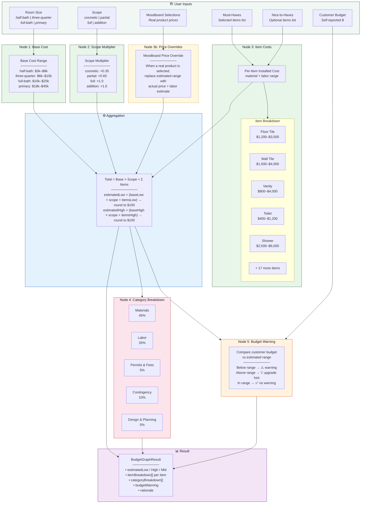
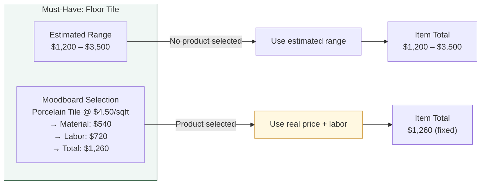
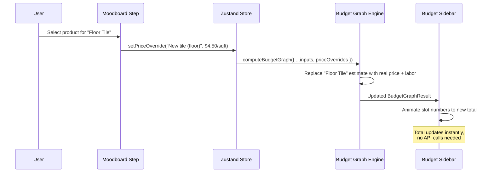

# Budget Estimator — Knowledge Graph

> Visual representation of how the deterministic budget engine computes renovation cost estimates.

## Computation Flow

## Item-Level Breakdown Flow

## Data Flow: Moodboard → Budget Update

## Item Cost Table

| Item | Material Low | Material High | Labor Low | Labor High | Total Low | Total High |
|------|-------------|---------------|-----------|------------|-----------|------------|
| New tile (floor) | $540 | $1,575 | $660 | $1,925 | $1,200 | $3,500 |
| New tile (shower walls) | $675 | $1,800 | $825 | $2,200 | $1,500 | $4,000 |
| Single vanity | $360 | $1,125 | $440 | $1,375 | $800 | $2,500 |
| Walk-in shower | $1,125 | $2,700 | $1,375 | $3,300 | $2,500 | $6,000 |
| Bathtub | $540 | $1,800 | $660 | $2,200 | $1,200 | $4,000 |
| Double vanity | $675 | $1,800 | $825 | $2,200 | $1,500 | $4,000 |
| Glass shower door | $360 | $1,125 | $440 | $1,375 | $800 | $2,500 |
| Heated floors | $675 | $1,575 | $825 | $1,925 | $1,500 | $3,500 |
| Comfort-height toilet | $180 | $540 | $220 | $660 | $400 | $1,200 |
