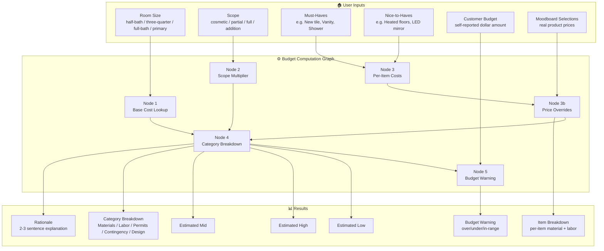
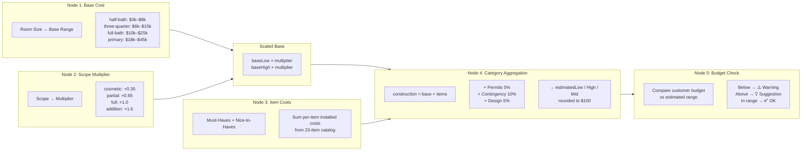
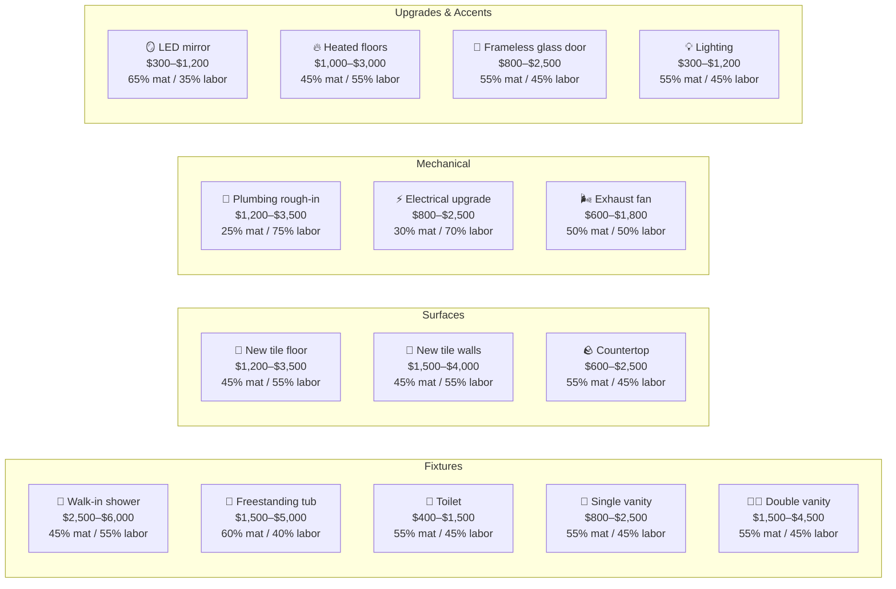
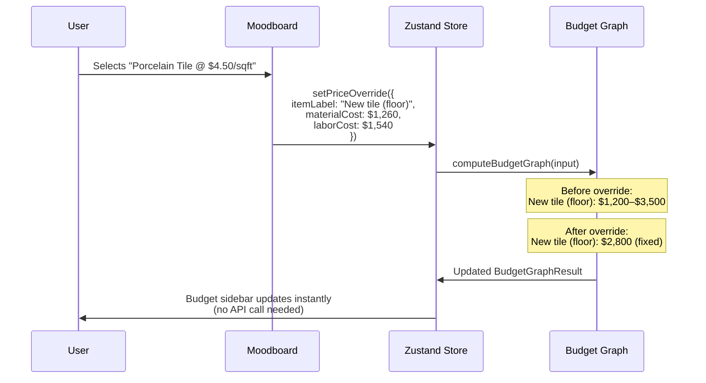
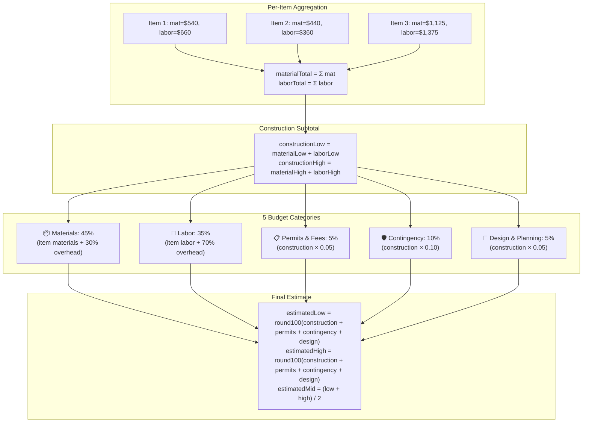
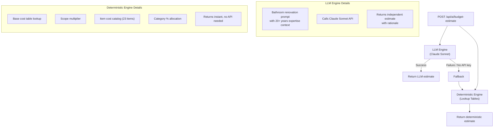
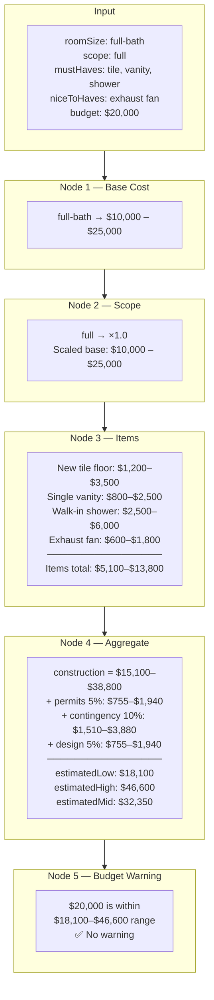

# Budget Estimator Model — Visual Guide

## Overview

The budget estimator is a **deterministic DAG (Directed Acyclic Graph)** that computes bathroom renovation cost estimates using lookup tables — no LLM required for the core calculation. An optional LLM engine can provide a second opinion.

---

## 1. High-Level Architecture



---

## 2. The 5-Node Computation Graph



---

## 3. Item Cost Catalog (23 Items)

Each item has an **installed cost range** and a **material:labor split ratio**.



---

## 4. Moodboard Price Override Flow

When a user picks a **real product** from the moodboard, the estimated range for that item is replaced with the actual price.



---

## 5. Category Breakdown Calculation



---

## 6. Dual Engine Strategy



---

## 7. Worked Example

**Input:** Full bathroom, full scope, 3 must-haves + 1 nice-to-have, $20k budget



---

## 8. Data Types (TypeScript)

```typescript
// ─── Inputs ──────────────────────────────────────────
interface BudgetGraphInput {
  roomSize:  "half-bath" | "three-quarter" | "full-bath" | "primary";
  scope:     "cosmetic" | "partial" | "full" | "addition" | null;
  mustHaves:          string[];     // item labels from catalog
  niceToHaves:        string[];
  includeNiceToHaves: boolean;
  customerBudget:     number | null;
  priceOverrides?:    PriceOverride[];
}

interface PriceOverride {
  itemLabel:    string;   // must match catalog label
  materialCost: number;   // actual price from moodboard product
  laborCost:    number;   // estimated labor
}

// ─── Outputs ─────────────────────────────────────────
interface BudgetGraphResult {
  estimatedLow:  number;   // rounded to $100
  estimatedHigh: number;
  estimatedMid:  number;
  breakdown:     BudgetGraphBreakdownItem[];  // 5 categories
  itemBreakdown: ItemCostBreakdown[];         // per-item detail
  budgetWarning: string | null;
  rationale:     string;
  nodes: {
    baseLow: number;  baseHigh: number;
    scopeMultiplier: number;
    itemsLow: number; itemsHigh: number;
    niceToHavesLow: number; niceToHavesHigh: number;
  };
}

interface ItemCostBreakdown {
  label:       string;
  materialLow: number;  materialHigh: number;
  laborLow:    number;  laborHigh:    number;
  totalLow:    number;  totalHigh:    number;
  overridden:  boolean;   // true = real moodboard price
  source:      "must-have" | "nice-to-have";
}
```

---

## Key Files

| File | Purpose |
|------|---------|
| `apps/web/src/lib/budget-engine/budget-graph.ts` | Core DAG computation, lookup tables, 23-item catalog |
| `apps/web/src/lib/budget-engine/types.ts` | Input/output TypeScript interfaces |
| `apps/web/src/lib/budget-engine/engines/estimate.ts` | LLM-based estimator (Claude Sonnet) |
| `apps/web/src/lib/budget-engine/engines/estimate-fallback.ts` | Deterministic lookup-table engine |
| `apps/web/src/lib/budget-engine/prompts/bathroom.ts` | LLM prompt with renovation expertise |
| `apps/web/src/lib/store.ts` | Zustand state management with price overrides |
| `apps/web/src/lib/room-sizes/bathroom.ts` | Room size definitions and sqft ranges |
| `apps/web/src/app/api/ai/budget-estimate/route.ts` | API route handler |
